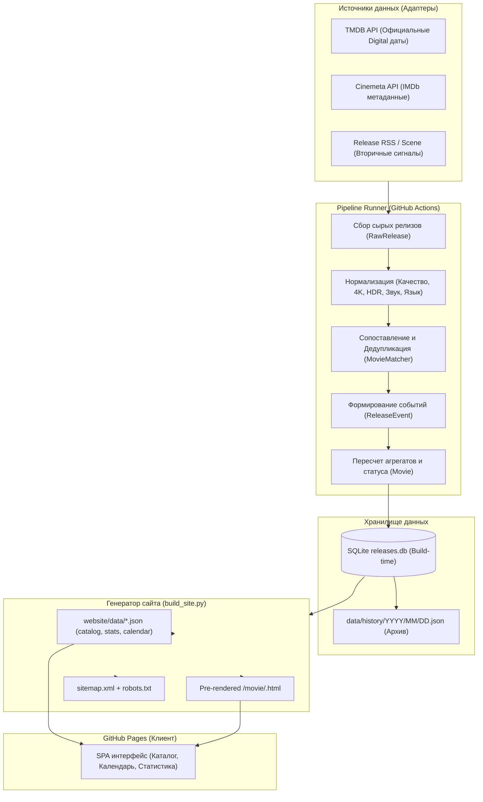

# Архитектура сервиса (ARCHITECTURE.md)

## 1. Концепция и обзор системы

Сервис спроектирован как **Serverless Data Pipeline + Static Site Generator**, ориентированный на запуск в GitHub Actions и хостинг на GitHub Pages.

### Схема потока данных (Data Flow)



---

## 2. Разделение сущностей

### 2.1. Фильм (`Movie`)
Центральная сущность каталога. Один фильм существует в базе строго в единственном экземпляре.
- Идентификатор `id`: отдаётся приоритет IMDb ID (`tt\d+`), затем TMDB ID (`tmdb_\d+`), при отсутствии — детерминированный хэш `m_{sha256(title+year)[:12]}`.
- Хранит:
  - Метаданные (названия, год, описание, постер, жанры, страны, хронометраж).
  - Внешние идентификаторы (`imdb_id`, `tmdb_id`).
  - Рейтинги и голоса (`imdb_rating`, `imdb_vote_count`, `tmdb_rating`, `tmdb_vote_count`).
  - Популярность (`popularity`, `popularity_source`).
  - Даты: `digital_release_date`, `first_detected_at`, `last_updated_at`.
  - Агрегаты: `best_quality`, `best_resolution`, `has_4k`, `has_hdr`, `has_ru_audio`, `status`.
  - Список привязанных событий `events: List[ReleaseEvent]`.

### 2.2. Событие релиза (`ReleaseEvent`)
Отражает конкретный факт появления цифрового релиза или обновления характеристик:
- `event_type`: `DIGITAL_PREMIERE`, `WEB_DL_DETECTED`, `BLURAY_DETECTED`, `RU_AUDIO_DETECTED`, `UHD_DETECTED`.
- `source_name`: название источника, зафиксировавшего событие.
- `source_release_date`: дата из фида источника.
- `detected_at`: точный момент времени (UTC ISO 8601), когда наш сборщик увидел релиз.
- `quality`: WEB-DL, WEBRip, BluRay, REMUX, UHD BluRay.
- `resolution`: 480p, 720p, 1080p, 2160p.
- `hdr`, `audio`, `language`, `release_group`.
- Детерминированный `id`: хэш от `movie_id + source + quality + resolution + hdr + audio + lang + source_date`.

---

## 3. Алгоритм дедупликации и сопоставления (`MovieMatcher`)

Каждый новый поступающий сигнал проходит многоуровневую проверку:
1. **Поиск по IMDb ID**: точное совпадение глобального ключа (наивысшая надежность).
2. **Поиск по TMDB ID**: точное совпадение ID базы The Movie Database.
3. **Сопоставление по нормализованному названию и году**:
   - Приведение названий к нижнему регистру, замена `&` -> `and`, римских цифр `II` -> `2`, удаление пунктуации и лишних пробелов.
   - Сравнение с русским и оригинальным названиями имеющихся фильмов.
   - Проверка разницы годов: `abs(m.year - cand.year) <= 1`.
4. **Нечеткое сравнение (Fuzzy Match)**:
   - При совпадении года с допуском в 1 год вычисляется коэффициент схожести SequenceMatcher. Порог срабатывания: `>= 0.88`.

---

## 4. Идемпотентность и целостность базы данных

- В SQLite таблице `release_events` первичным ключом является детерминированный `id`. Запрос на добавление события выполняется через `INSERT OR IGNORE`. Если событие уже зафиксировано — дубликат не создаётся.
- В таблице `movies` при обновлении сохраняется оригинальный timestamp первого обнаружения:
  ```sql
  ON CONFLICT(id) DO UPDATE SET
    title = excluded.title,
    first_detected_at = movies.first_detected_at, ...
  ```
- Повторный запуск пайплайна с теми же входными данными возвращает:
  `new_movies_count = 0`, `new_events_count = 0`.

---

## 5. Хранение истории и архив

- **Дневные снимки**: при каждом запуске формируются файлы:
  `data/history/YYYY/MM/DD.json`
  Каждый файл содержит массив фильмов, чей цифровой релиз или обнаружение пришлись на эту дату.
- **Индекс "В этот день"**:
  Файл `website/data/on_this_day.json` группирует фильмы по ключу `MM-DD` (месяц-день), связывая календарную дату с годами релизов (`YYYY`), позволяя моментально выводить сравнение 28 сентября за 2026, 2025, 2024 и другие годы.
- **Статические JSON-файлы сайта**:
  - `catalog.json`: полный оптимизированный массив фильмов для поиска и фильтрации на клиенте.
  - `latest.json`: 50 последних релизов для мгновенного первого рендеринга страницы.
  - `calendar.json`: карта дат и количества релизов `{ "2026-09-28": 12, ... }`.
  - `stats.json`: предварительно рассчитанные распределения по месяцам, форматам и рейтингам.

---

## 6. Отслеживание метрик (IMDb, популярность, голоса)

В соответствии с правилами проекта:
- Рейтинг IMDb и число голосов не сливаются в один искусственный показатель.
- Популярность TMDB хранится с явным указанием источника (`popularity_source: "TMDB"`).
- Неизвестные значения сохраняются как `null` и отображаются как `—`, а при сортировках (по убыванию или возрастанию) смещаются в конец списка.
- Для фиксации динамики показателей ведётся таблица `rating_history (movie_id, recorded_date, imdb_rating, imdb_vote_count, popularity)`.
